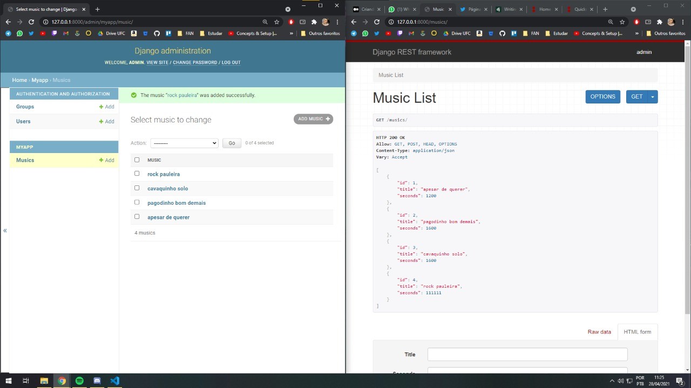

# Django rest framework test

teste usando o framework para fazer uma API simples com gerenciador

     > referências:
     >  - https://medium.com/@marcosrabaioli/criando-uma-api-rest-utilizando-django-rest-framework-parte-1-55ac3e394fa
     >  - https://docs.djangoproject.com/en/3.2/intro/tutorial02/

\

